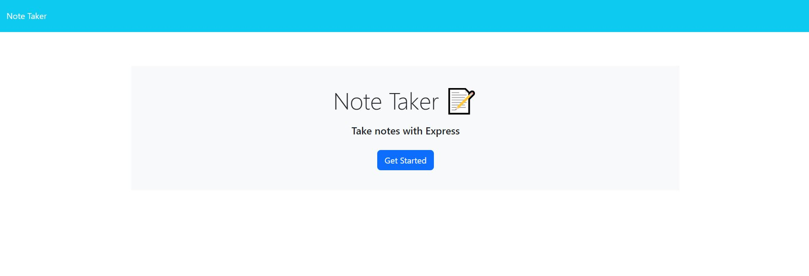
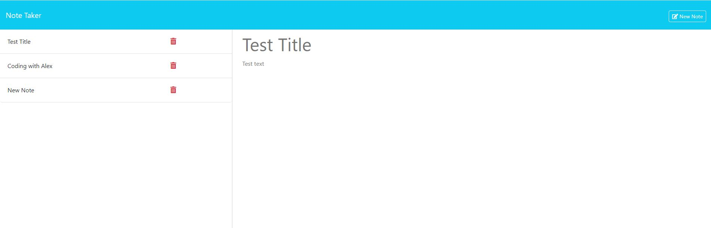

# Note Taker Application

## Description

This is a simple note-taking application that allows users to create, save, and view notes. The application features a landing page with a link to a notes page where users can interact with their notes.

## Features

1. **Landing Page**
   - Users are presented with a landing page that contains a link to the notes page.

2. **Notes Page**
   - The notes page displays existing notes in the left-hand column.
   - Users can enter a new note title and text in the right-hand column.
   - A "Save Note" button and a "Clear Form" button appear in the navigation when entering a new note.

3. **Saving Notes**
   - Users can save a new note by clicking the "Save Note" button.
   - The new note is saved and appears in the list of existing notes in the left-hand column.
   - The "Save Note" and "Clear Form" buttons disappear after saving the note.

4. **Viewing Notes**
   - Users can click on an existing note in the left-hand column to view its content in the right-hand column.
   - A "New Note" button appears in the navigation when viewing an existing note.

5. **Creating New Notes**
   - Users can click the "New Note" button in the navigation to clear the fields and enter a new note.
   - The "New Note" button disappears after clicking it.

## Screenshot
 - Main Page

 - Notes Page

## Usage

1. **Opening the Note Taker**
   - Open the application to view the landing page.
   - Click the link on the landing page to navigate to the notes page.

2. **Adding a New Note**
   - On the notes page, enter a note title and the note’s text in the right-hand column.
   - Click the "Save Note" button in the navigation to save the note.
   - The note will appear in the list of existing notes in the left-hand column.

3. **Viewing an Existing Note**
   - Click on an existing note in the left-hand column to view it in the right-hand column.
   - The "New Note" button will appear in the navigation.

4. **Creating Another New Note**
   - Click the "New Note" button in the navigation to clear the fields for a new note.
   - Enter the new note’s title and text, and click "Save Note" to add it to the list of existing notes.

## Installation

To install and run the application locally:

1. Clone the repository:
   ```bash
   git clone https://github.com/AlexCapilla/note-taker.git

2. Navigate to the project directory:
    ```bash
    cd note-taker

3. Install the dependencies:
    ```bash
    npm install

4. Start the application:
    ```bash
    npm start

## Technologies Used
- HTML
- CSS
- JavaScript
- Node.js
- Express.js

## Deployment
Render Link: https://note-taker-aolh.onrender.com

## License
This project is licensed under the MIT License.